# 


 <a type="button" title="Codecademy_Learn_C_Course_button" href="https://www.codecademy.com/paths/c/tracks/going-further-with-c-sp/modules/arrays-and-strings-c-sp/projects/anagram-finder-c" target="_blank" data-CodecademyLearnCCourseButt="CodecademyLearnCCourseButt_data"></a>


<br><br>


# Anagram Finder

# 1. Introduction:
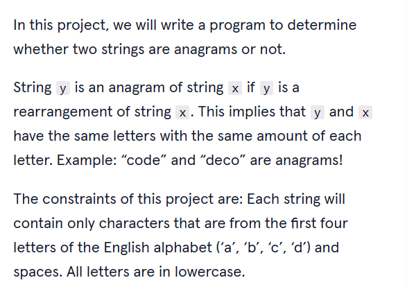

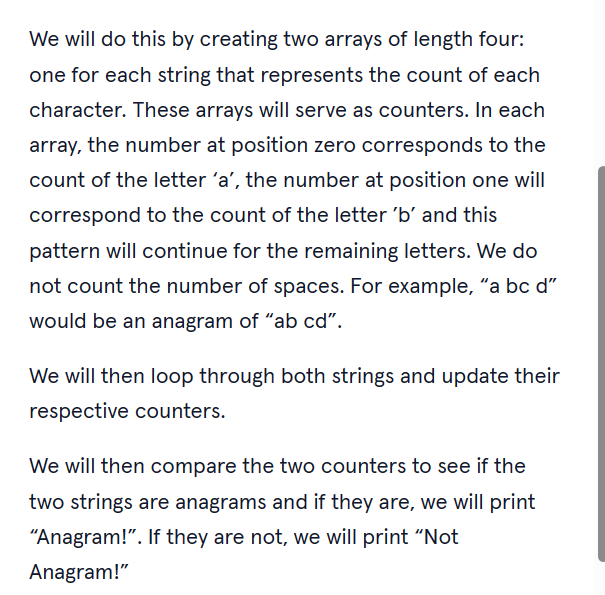

# 2. Output:


Anagram!

# 3. Prompts:

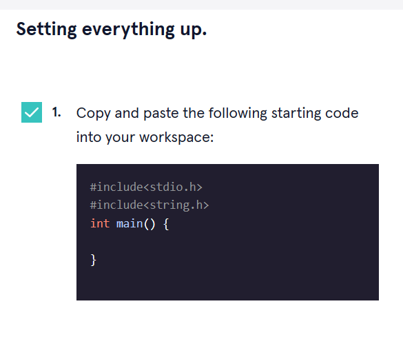

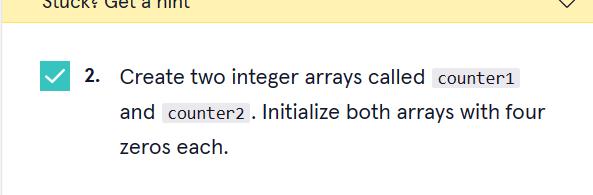

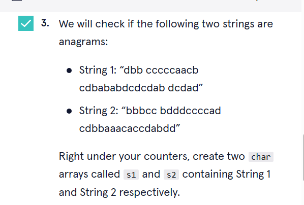

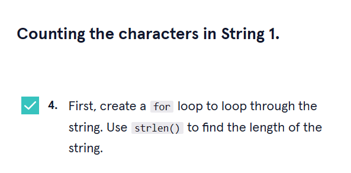

```c
#include<stdio.h>
#include<string.h>
int main() {
  int counter1[] = {0,0,0,0};
  int counter2[] = {0,0,0,0};
  char s1[] = "dbb cccccaacb cdbababdcdcdab dcdad";
  char s2[] = "bbbcc bdddccccad cdbbaaacaccdabdd";
  for(int i=0; i<strlen(s1); i++){
    
  }
}
```

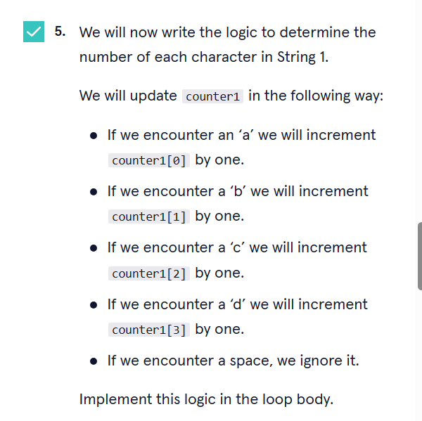

```c
#include<stdio.h>
#include<string.h>
int main() {
  int counter1[] = {0,0,0,0};
  int counter2[] = {0,0,0,0};
  char s1[] = "dbb cccccaacb cdbababdcdcdab dcdad";
  char s2[] = "bbbcc bdddccccad cdbbaaacaccdabdd";
  for(int i=0; i<strlen(s1); i++){
    switch(s1[i]){
      case 'a':
        counter1[0]+=1;
        break;
      case 'b':
        counter1[1]+=1;
        break;
      case 'c':
        counter1[2]+=1;
        break;
      case 'd':
        counter1[3]+=1;
        break;
    }
  }
}
```

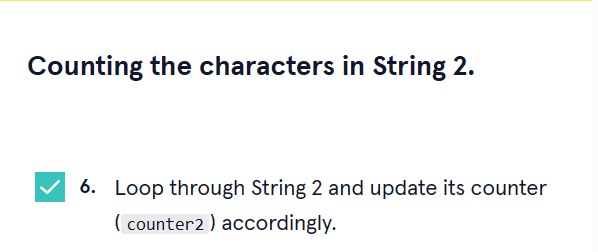

```c
#include<stdio.h>
#include<string.h>
int main() {
  int counter1[] = {0,0,0,0};
  int counter2[] = {0,0,0,0};
  char s1[] = "dbb cccccaacb cdbababdcdcdab dcdad";
  char s2[] = "bbbcc bdddccccad cdbbaaacaccdabdd";
  for(int i=0; i<strlen(s1); i++){
    switch(s1[i]){
      case 'a':
        counter1[0]+=1;
        break;
      case 'b':
        counter1[1]+=1;
        break;
      case 'c':
        counter1[2]+=1;
        break;
      case 'd':
        counter1[3]+=1;
        break;
    }
  }

  for(int i2=0; i2<strlen(s2); i2++){
    switch(s2[i2]){
      case 'a':
        counter2[0]+=1;
        break;
      case 'b':
        counter2[1]+=1;
        break;
      case 'c':
        counter2[2]+=1;
        break;
      case 'd':
        counter2[3]+=1;
        break;
    }
  }
}
```

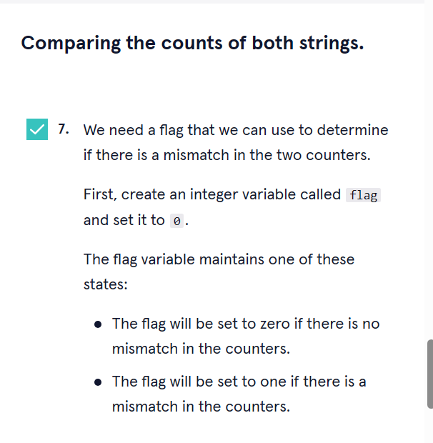

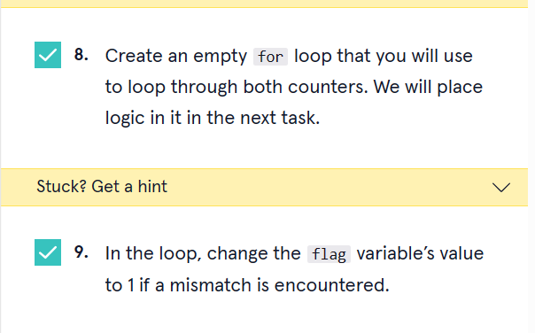

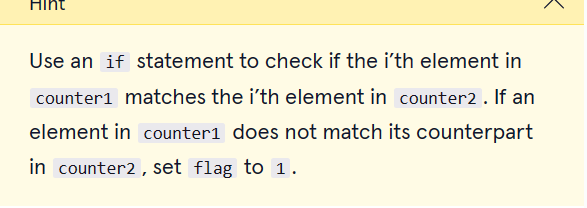

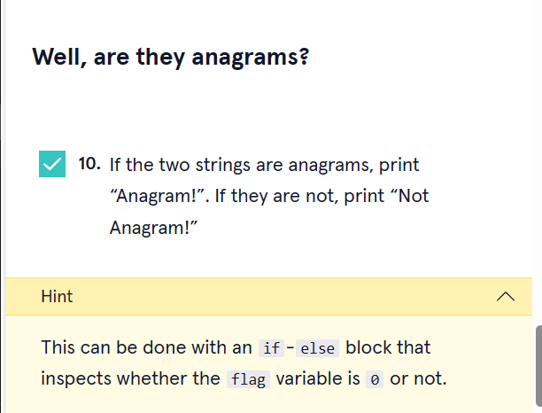


