# 

 

  

# Dates and Switches

# 1. Introduction:
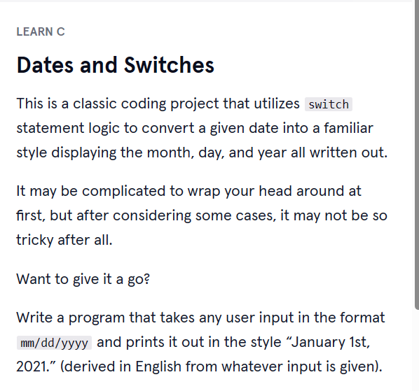

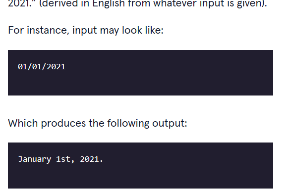

# 2. Output:
# **Notice**: I didn't finish this project since it requires writing too much line of switch cases that seem to be tedious tasks just to print out some prefix that attach to each day of a month.

# 3. Prompts:

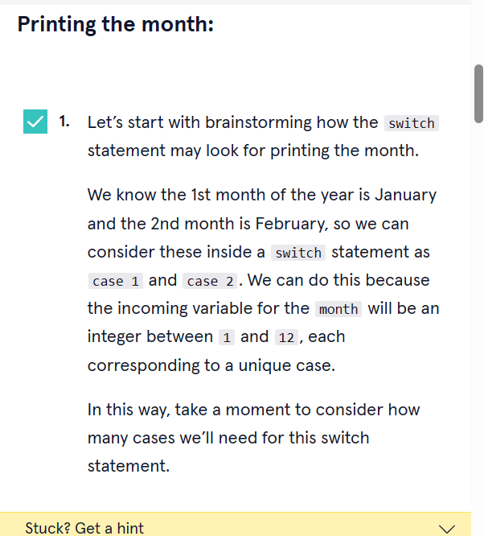

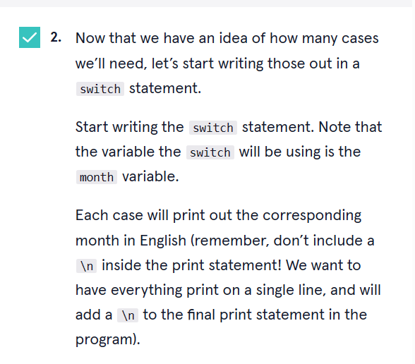

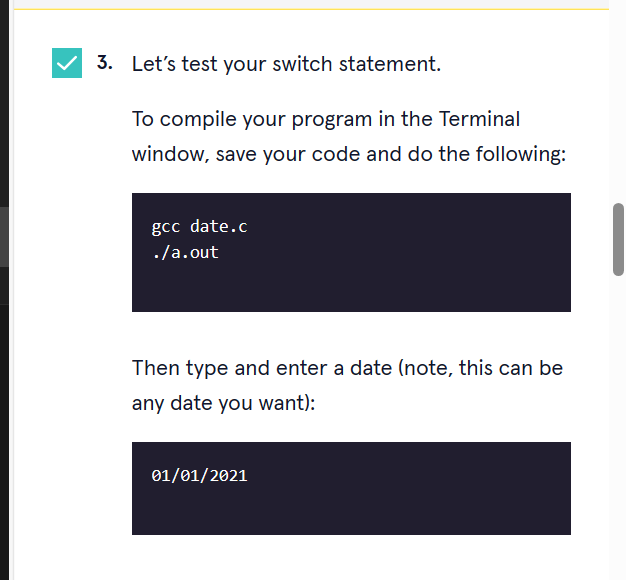

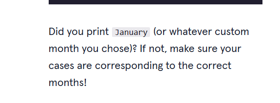

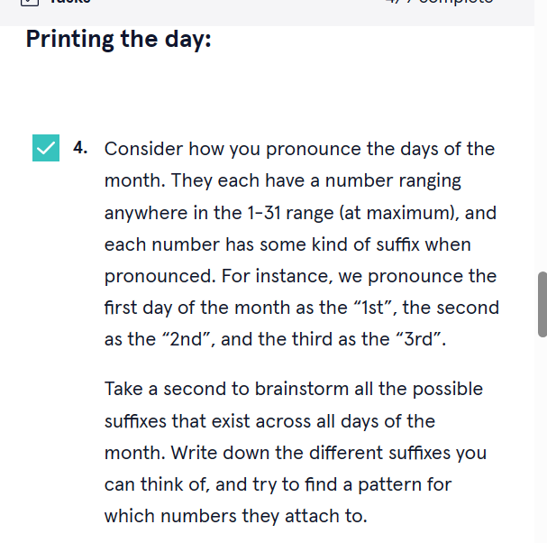

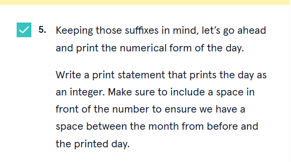

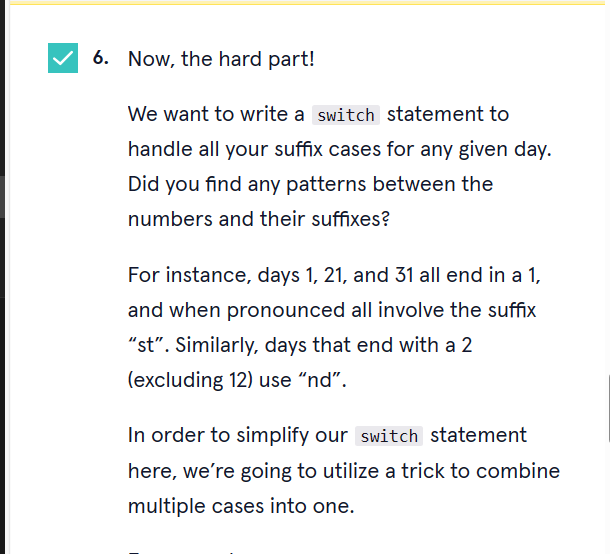

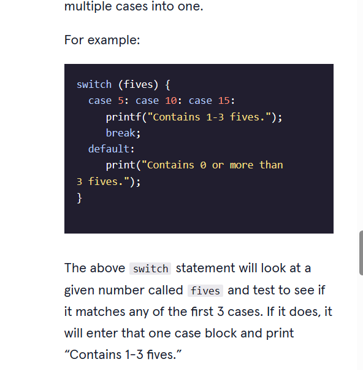

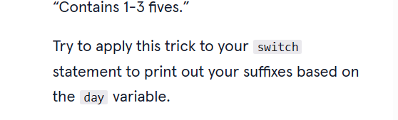

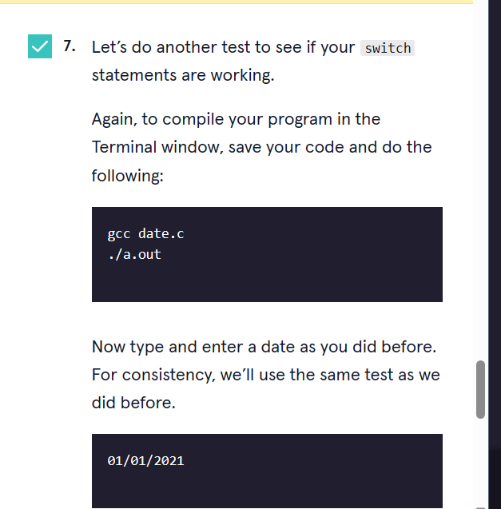

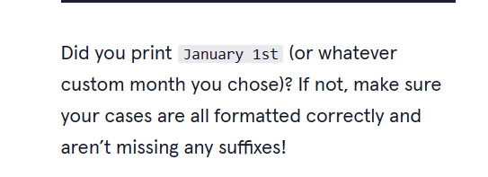

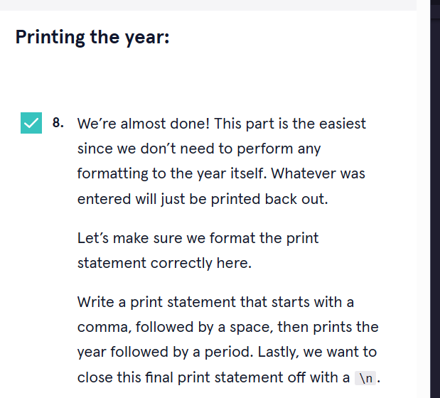

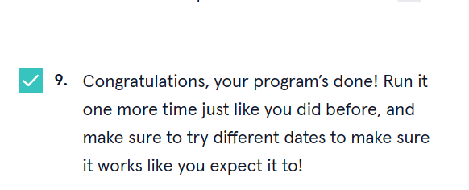

