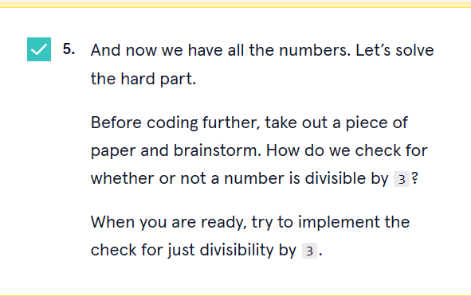

# 


 <a type="button" title="Codecademy_Learn_C_Course_button" href="https://www.codecademy.com/paths/c/tracks/c-control-flow-sp/modules/loops-and-errors-c-sp/projects/fizzbuzz-c" target="_blank" data-CodecademyLearnCCourseButt="CodecademyLearnCCourseButt_data"></a>


<br><br>


# Fizz Buzz

# 1. Introduction:


# 2. Output:


# 3. Prompts:


```C
#include <stdio.h>
int main(){
  for(int i=1;i<=100;i++){
    printf("%d\n",i);
  }
}
```



```C
#include <stdio.h>
int main(){
  for(int i=1;i<=100;i++){
     if(i%3==0 && i%5==0){
       printf("FizzBuzz \n");
     }else if(i%3==0){
        printf("Fizz \n");
     }else if(i%5==0){
        printf("Buzz \n");
     }else{
        printf("%d \n",i);
     }
  }
}
```