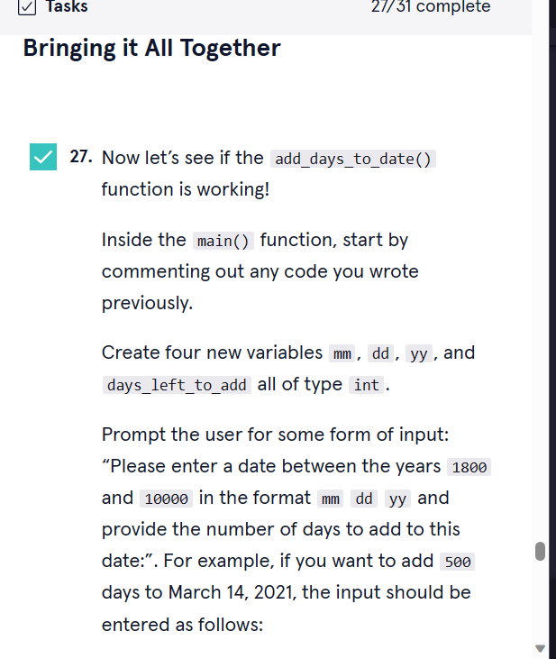
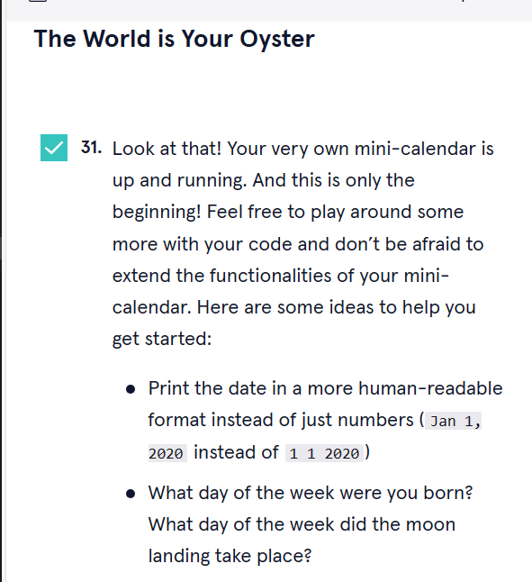

# 


 <a type="button" title="Codecademy_Learn_C_Course_button" href="https://www.codecademy.com/paths/c/tracks/functions-and-structures-in-c-sp/modules/functions-c-sp/projects/mini-calendar-c" target="_blank" data-CodecademyLearnCCourseButt="CodecademyLearnCCourseButt_data"></a>


<br><br>


# Mini-Calendar

# 1. Introduction:


# 2. Notice:
> The program will ask the developer to build many ```else if``` condition. In my opinion, a developer should not use ```else if``` condition when it comes to dealing with many cases that can be happen to solve a problem. A developer should use ```if``` condition and child ```if``` condition inside its parent ```if``` statement instead. It will make the code more readable and easier to debug. 

# 3. Output:


# 4. Prompts:


```c
#include <stdio.h>
#include <stdbool.h>
bool is_leap_year(int year){
  if(year%4 != 0){
    return false;

  }
  
  if(year%4 == 0){

     if(year%100 != 0){
      return true;
     }

     if(year%100 == 0 && year%400 != 0){
       return false;
     }

     if(year%100 == 0 && year%400 == 0){
       return true;
     }

  }
}
int main() {
  int year;
  scanf("%d",&year);
  printf("Is the input year a leap year? >> %d",is_leap_year(year));
}
```


```c
int main() {
  int year;
  scanf("%d",&year);
  printf("Is the input year a leap year?\n");
  is_leap_year(year) == true? printf(">> Leap Year\n"): printf("Not Leap Year\n");
}
```


```c
int days_in_month[] = {0,31,28,30,31,30,31,30,31,30,31,30,31};

void add_days_to_date(int* mm, int* dd, int* yy, int days_left_to_add){

}
```


```c
int days_in_month[] = {0,31,28,30,31,30,31,30,31,30,31,30,31};

void add_days_to_date(int* mm, int* dd, int* yy, int days_left_to_add){

  int days_left_in_month;

  while(days_left_to_add > 0){
    days_left_in_month = days_in_month[*mm]-(*dd);
  }
}
```


```c
void add_days_to_date(int* mm, int* dd, int* yy, int days_left_to_add){


  int days_left_in_month;

  while(days_left_to_add > 0){
    days_left_in_month = days_in_month[*mm]-(*dd);

    if(*mm == 2 && is_leap_year(*yy) == true){
      days_left_in_month+=1;
    }
  }
}
```





```c

  int mm,dd,yy,days_left_to_add;
  printf("Please enter a date between the years 1800 and 10000 in the format mm dd yy and provide the number of days to add to this date: \n");
  scanf("%d%d%d%d",&mm,&dd,&yy,&days_left_to_add);
  add_days_to_date(&mm,&dd,&yy,days_left_to_add);

  printf("Month: %d, Day: %d, Year: %d, Days left to add: %d. \n",mm,dd,yy,days_left_to_add);
```





