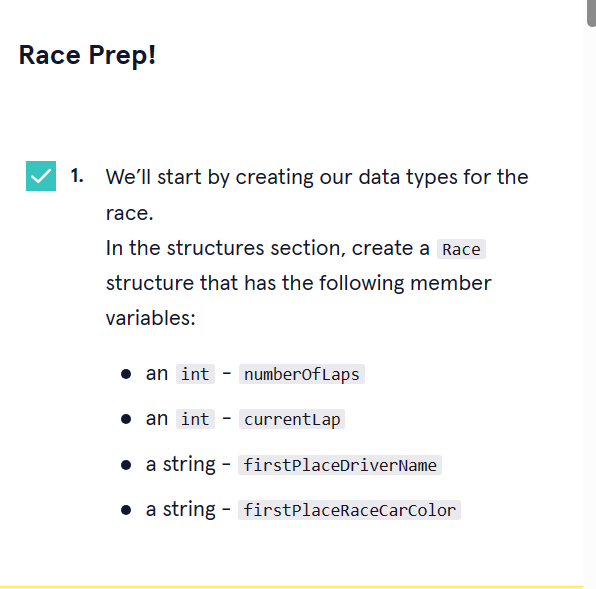

# 


 <a type="button" title="Codecademy_Learn_C_Course_button" href="https://www.codecademy.com/paths/c/tracks/functions-and-structures-in-c-sp/modules/structures-c-sp/projects/learn-c-race-simulator" target="_blank" data-CodecademyLearnCCourseButt="CodecademyLearnCCourseButt_data"></a>


<br><br>


# Race Simulator

# 1. Introduction:


# 2/ Notices:
> I'm not sure if I got the logic from step 11 to 13 right or not since the document doesn't provide enough details for it. In general, the program run well. 

# 3. Output:


# 4. Prompts:




```c
struct Race{
  int numberOfLaps;
  int currentLap;
  char* firstPlaceDriverName;
  char* firstPlaceRaceCarColor;
};
```


```c
struct RaceCar{
  char* driverName;
  char* raceCarColor;
  int totalLapTime;
};
```


```c
void printIntro(void){
  printf("Welcome to our main event digital race fans!\nI hope everybody has their snacks because we are about to begin!\n\n");
}
```


```c
void printCountDown(void){
  printf("Racers Ready! In...\n5\n4\n3\n2\n1\nRace!\n");
}
```


```c
void printFirstPlaceAfterLap(struct Race race){
  printf("Current lap number: %d.\nFirst Place is: %s in the %s race car.\n",race.currentLap, race.firstPlaceDriverName, race.firstPlaceRaceCarColor);
}

void printCongratulation(struct Race race){
  printf("Let's all congratulate %s in the %s race car for an amazing performance.\nIt truly was a great race and everybody have a goodnight!",race.firstPlaceDriverName,race.firstPlaceRaceCarColor);
}
```


```c
int calculateTimeToComplateLap(void){
  int speed,acceleration, nerves;
  speed = (rand() % 3) + 1;
  acceleration = (rand() % 3) + 1;
  nerves = (rand() % 3) + 1;   return speed+acceleration+nerves;

}
```


```c
void updateRaceCar(struct RaceCar* raceCar){
  raceCar->totalLapTime+=calculateTimeToComplateLap();
}
```


```c
void updateFirstPlace(struct Race* race, struct RaceCar* raceCar1, struct RaceCar* raceCar2){
  if(raceCar1->totalLapTime<=raceCar2->totalLapTime){

    race->firstPlaceDriverName = raceCar1->driverName;
    race->firstPlaceRaceCarColor = raceCar1->raceCarColor;

  }else{

    race->firstPlaceDriverName = raceCar2->driverName;
    race->firstPlaceRaceCarColor = raceCar2->raceCarColor;

  }
}
```


```c
void startRace(struct RaceCar* raceCar1, struct RaceCar* raceCar2){
  struct Race race = {5,1,"",""};
}
```


```c

void startRace(struct RaceCar* raceCar1, struct RaceCar* raceCar2){

  struct Race race = {5,1,"",""};
  struct Race* getRace = &race;

  for(int i=0; i<race.numberOfLaps; i++){

    updateRaceCar(raceCar1);
    updateRaceCar(raceCar2);

    updateFirstPlace(getRace,raceCar1,raceCar2);

    printFirstPlaceAfterLap(race);
  }
  printCongratulation(race);
}


int main() {
  struct RaceCar raceCar1 = {"Frank","Blue",6};
  struct RaceCar raceCar2 = {"Terry","Red",4};    

	srand(time(0));
  printIntro();
  printCountDown();
  startRace(&raceCar1, &raceCar2);
  
};
```